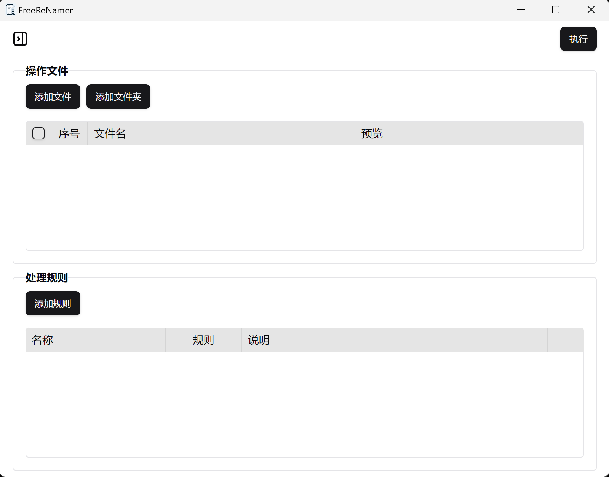
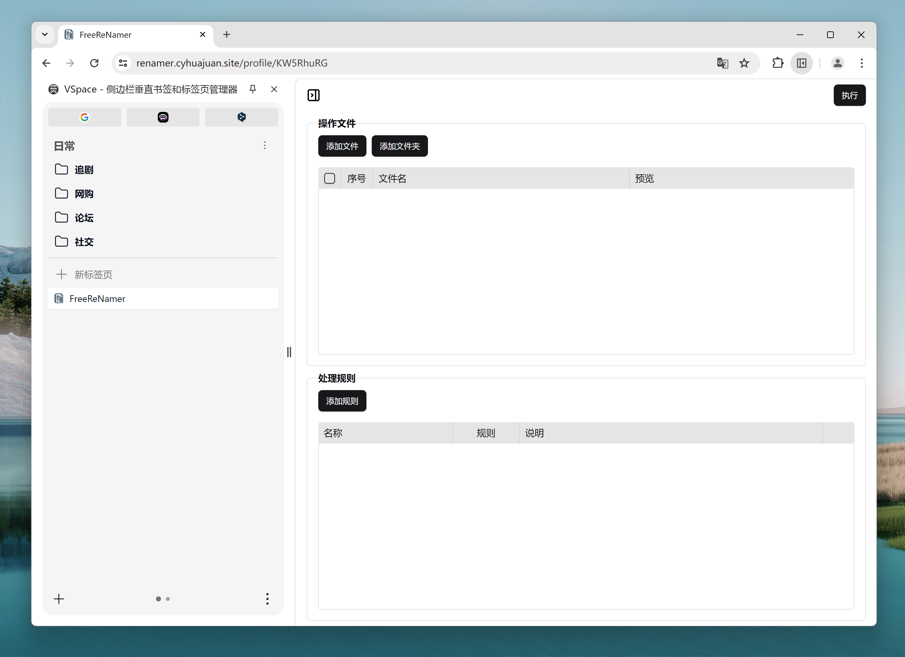

    

    <h1>
      
       
      FreeReNamer
    </h1>
    <h4>功能强大又易用的文件批量重命名软件</h4>
    
网页版在线体验：<a href="https://renamer.cyhuajuan.online" target="_blank">https://renamer.cyhuajuan.online</a>

    
客户端下载：<a href="https://github.com/cyhuajuan/FreeReNamer/releases">release</a>

  

## 

## 桌面版预览

## 网页版预览

## 网页端和桌面端的一些区别

- 网页端使用的FileSystemHandle的move api，兼容性较差，推荐使用最新版本的chrome浏览器。客户端是原生API，兼容性没问题。
- 网页端会有额外的操作权限确认，这是浏览器本身的安全处理。客户端没有。
- 配置数据网页端是存储在indexedDB，桌面端是存储在文件

## 功能

- 支持拖拽添加文件和文件夹
- 支持创建多个配置
- 单个配置内支持多个规则
- 支持js脚本，内置Monaco Editor。
- 跨平台，支持windows,macos,linux