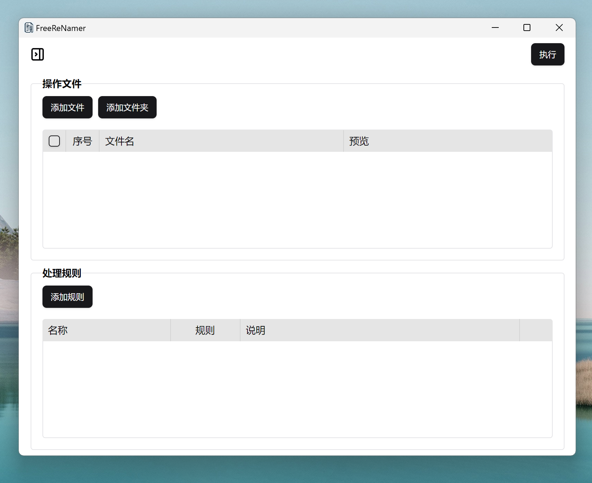

    

    <h1>
      
       
      FreeReNamer
    </h1>
    <h4>功能强大又易用的文件批量重命名软件</h4>
  

## 预览

## 功能

- 支持拖拽添加文件和文件夹
- 支持创建多个配置
- 单个配置内支持多个规则
- 支持js脚本，内置Monaco Editor。
- 跨平台，支持windows,macos,linux